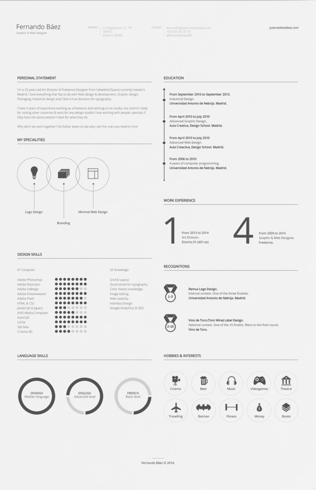

# AutoResume

  

AutoResume 是一个简历模板网站，用 React + NodeJS 进行开发，受 [EFResume](https://github.com/EyreFree/EFResume)及[zresume](https://github.com/izuolan/zresume) 启发，将其改成网站版，😂。设计稿来源于 [FREE Resume Template](https://www.behance.net/gallery/15677411/FREE-Resume-Template)。初版比较简陋，欢迎大家提 Issue 和 PR，希望能和大家一起改进这份简历，然后好用的话望大佬们赏个 Star，🙏，有问题可以来撩我。

## 预览

  

## 示例

[https://github.com/FEYeh/autoresume](https://github.com/FEYeh/autoresume)

## 环境

- Node v8.9.1

## 安装

1. 首先需要安装 Node
2. 利用 `git clone` 命令下载本仓库；
3. 然后运行 `npm rebuild node-sass` 编译node-sass。
4. 最后运行 `npm run start` 启动本应用

## 使用

1. 启动本应用并打开http://localhost:3000/；
2. 点击左侧菜单【Templates】进入模板库；
3. 点击template1的【Create】按钮进入【Create Resume】页面；
4. 根据帮助填写简历信息并点击【Create】按钮创建简历，成功后会自动跳转到我的简历库；
5. 点击resume1的【Goto】按钮可以查看生成的简历；
6. 点击下载可以下载打包好的简历，然后可以把生成的简历上传到Github或自己的网站上。
7. Good luck!

## 作者

FEYeh

## 协议

AutoResume 基于 MIT 协议进行分发和使用，更多信息参见协议文件。